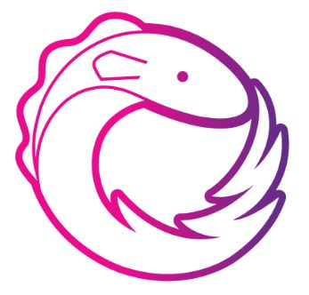
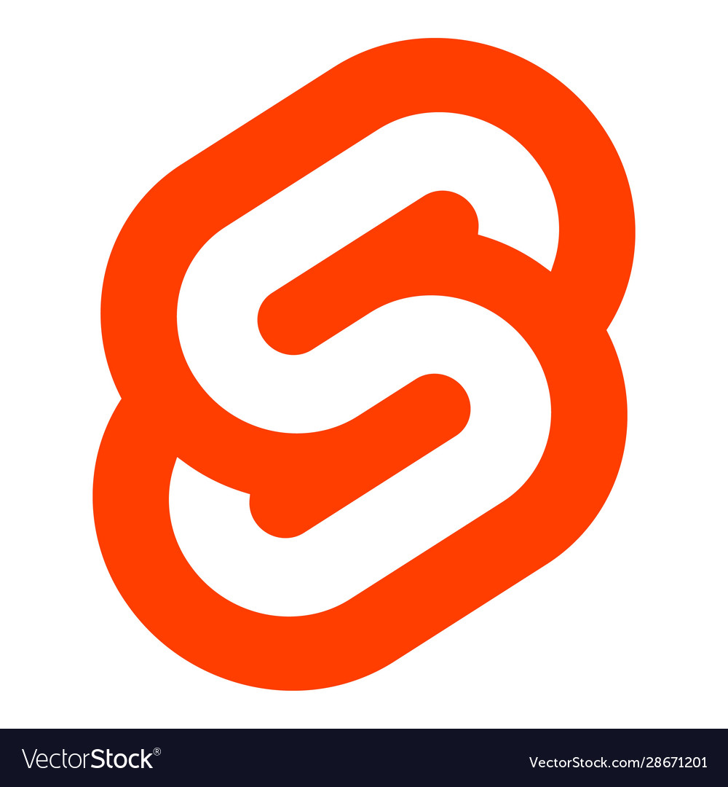

### Hi there 👋,  I'm Jonas Founkeu
##      a frontend developer specialized in React

- 🔭 I’m currently working on [Frontendtools.dev](https://frontend-toolkit-f93tktkhq-sauravgupta2800.vercel.app/) 
- 🌱 I’m currently learning AWS, Kubernetes, TypeScript ans GraphQL...
- 👯 I’m looking to collaborate on any impactful web projects ...
- I regularly write articles on [medium.com/@jonasfounkeu](https://medium.com/@jonasfounkeu)
- 💬 Ask me about Javascript, CSS, React, VueJS, NodeJS, TypeScript, Svelte and Python...
- 📫 How to reach me: jfounkeu@gmail.com ...

- ⚡ Fun fact:  I am the best React developer in africa ...

## Connect with me:
[linkedin.com](https://www.linkedin.com/in/jonasfounkeu/)
 

[twitter.com](https://www.twitter.com/JFounkeu/)
 

## Languages and Tools:

  
  
  
  
  
  
   
   
   
 
  
  
  
  
  

## My github stats

